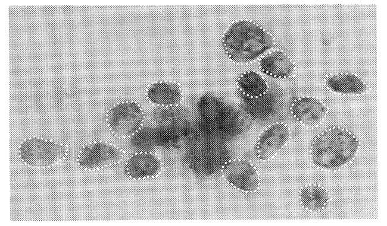
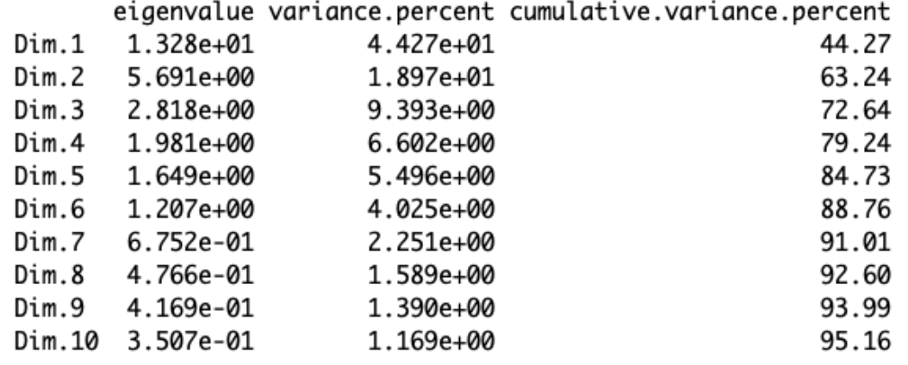
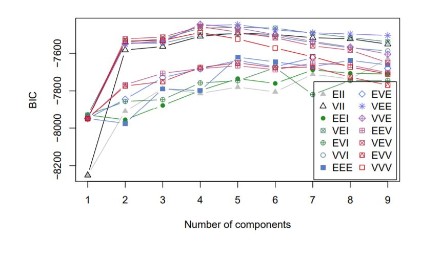

```{r setup, include=FALSE, echo = FALSE, warning=FALSE, message = FALSE}
knitr::opts_chunk$set(echo = FALSE, warning = F, comment = F, fig.align="center")

# Import Libraries
library(dplyr)
library(ggplot2)
library(knitr)
library(kableExtra)
library(reshape2)
library(tidyverse)  # data manipulation
library(cluster)    # clustering algorithms
library(factoextra) # clustering algorithms & visualization
library(caret) # sensitivity & specificity
library(e1071)
library(ClusterR)
library(RColorBrewer)
library(reshape)
library(MASS)
library(mclust)
library(gridExtra)
library(corrplot)
library(class)
library(e1071)
library(glmnet)
library(RcmdrMisc)
library(scatterplot3d)
library(rgl)
library(rglwidget)
set.seed(20) # be able to reproduce outputs
```


```{r}
#########################
# Import Data & Prepare #
#########################

# Load original data
raw_data <- read.csv("data.csv", header = T)

# Get index for mean columns
mean_col <- grep("mean", names(raw_data))

# Add total score
raw_data$totalScore <- rowSums(raw_data[,mean_col])

# Look at total score boxplot
#plot(raw_data$diagnosis, raw_data$totalScore)

# Y values (no fractal dimension or diagnosis columns)
Y <- raw_data[,-c(1, 2, dim(raw_data)[2], dim(raw_data)[2]-1)]

benign <- raw_data %>%  filter(raw_data$diagnosis == "B") 
cutoff <- max(benign$totalScore)

#########################
# Add New Classes #
#########################

# New classes
# 1: Benign
# 2: Malignant & totalScore <= 1138.2
# 3: Malignant & totalScore > 1138.2 EASILY IDENTIFIABLE AS MALIGNANT
X <- ifelse((raw_data$diagnosis == "B"), "1", 
            ifelse((raw_data$diagnosis == "M" & raw_data$totalScore <= cutoff), "2", "3"))

Classification <- ifelse((raw_data$diagnosis == "B"), "B", 
            ifelse((raw_data$diagnosis == "M" & raw_data$totalScore <= cutoff), "M - Low Score", "M - High Score"))


classes <- as.data.frame(X)
#classes %>% group_by(classes$X) %>% count()

```

## Introduction  
```{r, fig.align="center"}

```

The accuracy of image processing techniques in determining the diagnosis for breast tumors has been an area of interest in the biomedical field. Image processing is much less invasive than biopsies, which is a common procedure used to diagnose tumors. Image processing can capture different angles and contours to extract information about a tumor's size, shape, and texture. In 1992, scientists used image processing techniques to acquire measurements for cell nuclei of breast cancer tumors. The motivation was to determine if these techniques can improve the accuracy and speed of the breast tumor diagnosis process.   

The following measurements were recorded for 569 tumors: 

Radius  
Perimeter  
Area  
Compactness   
Smoothness  
Concavity  
Concave Points  
Symmetry  
Fractal Dimension  

Each tumor contains a cluster of cells; the mean, standard errors, and worst or highest values seen were recorded. By design, higher feature values "indicate a higher likelihood of malignancy"[1].

## Exploratory Data Analysis   
Below are the counts for benign (B) and malignant (M) tumors. About 63% of the data corresponds to benign tumors and 37% correspond to malignant tumors.   
    
    
```{r}
colN <- c("Diagnosis", "Count")
counts <- raw_data %>% group_by(raw_data$diagnosis) %>% count()
colnames(counts) <- colN
kable(counts, caption= "Observation Counts", align = c("r", "r"), longtable = T)
```

Below is the correlation plot for the mean variables. Unsurprisingly, we see strong linear correlations between radius, perimeter, and area. Similar trends in correlations are seen for standard errors and worst values; measures pertaining to the size of cells are highly correlated.     
```{r, , fig.height= 8, fig.width=12}
Ymat <- as.matrix(Y[,1:10])
corrplot(cor(Ymat), is.corr = TRUE,
         type = "lower",
         oma=c(0.1,0.1,0.1,0.1),
         mar=c(0,0,1,0), diag=TRUE, 
         title = "Correlation Plot Between Mean Measurements")
```

The scatterplots below for the mean values show clear separations between the 2 classes (malignant and benign) for several features; this indicates that there are variables that may be helpful in classifying tumors. We also see strong linear correlations as indicated by the correlation plot above. In the clustering analysis, we will use principal components to remove some of the redudancy that comes from the several correlated features. 

```{r, fig.height=6}
pairs(Y[,1:10], col=factor(raw_data$diagnosis), main = "Mean Parameter Values")
par(xpd=TRUE)
legend(0.8, 1.35, as.vector(unique(raw_data$diagnosis)), cex=.8, pt.cex = .8,
       fill=c("red", "black"))
```
Below are the boxplots for the mean features. We see that several features have distinct distributions depending on the diagnosis such as the radius, perimeter, and concavity mean parameters. The distributions for fractal dimensions seem to be the most similar between benign and malignant; this suggests that this feature may not be very helpful in classifying tumors as compared to other features. We will use principal components analysis to reduce redundancy in the data and the number of dimensions.
```{r, fig.height=5}
#data <- raw_data[,-c(1, length(names(raw_data)), length(names(raw_data))-1)]
#means <- data %>% group_by(diagnosis) %>% summarise_all("mean")
#means[,-c(1)] <- round(means[,-c(1)], 4)
#means <- t(means) 
#kable(means, caption= "Mean Parameter Values", align = c("r", "r"), longtable = T)  %>%
#kable_styling(latex_options = c("repeat_header", "striped", "hold_position"))  

reshapedD <- melt(cbind(raw_data$diagnosis, as.data.frame(Ymat)), id="raw_data$diagnosis")
reshapedD <- as.data.frame(reshapedD,  stringsAsFactors = FALSE)
colNames <- c("diagnosis", "feature", "value")
colnames(reshapedD) <- colNames
reshapedD$feature <- ifelse(reshapedD$feature == "fractal_dimension_mean", "fractal_dim_mean", as.character(reshapedD$feature))
ggplot(data = reshapedD) +
  geom_boxplot(aes(diagnosis, value, fill = diagnosis))+
  facet_wrap(.~ feature, scales="free")+
  ggtitle("Boxplots by Diagnosis for Mean Features")+ theme(legend.position="none")+
  xlab("") + ylab("")
```

The clustering analysis will be done using the first principal components, which explain 72% of the variance.

```{r, fig.align="center", fig.height=2, fig.width=6}

```

```{r}
pca <- prcomp(Y, center = TRUE,scale. = TRUE)
pca3 <- pca$x[,1:3]
```

## Clustering   
It is vital to be able to distinguish whether patients have malignant tumors accurately and quickly. The quicker a tumor is accurately diagnosed, the quicker the patient can undergo treatment. We will test different clustering methods that could possibly help identify the diagnosis of breast tumors. 

### K-means   
First, we will use the K-means clustering method and review it's accuracy to determine how well the model classifies benign and malignant tumors.   

Using the silhoutte method, the K-means algorithm suggests k=2; this nicely aligns with the benign and malignant classes.
```{r, fig.width=8, fig.height=4}
# Elbow method
elb <- fviz_nbclust(pca3, kmeans, method = "wss") +
  labs(subtitle = "Elbow method")

# Silhouette method
sil <- fviz_nbclust(pca3, kmeans, method = "silhouette")+
  labs(subtitle = "Silhouette method")


#elb
sil

```

We see that the 2 K-means clusters are clearly distinguished in the first and second principal components. However, the clusters are not as clearly defined when looking at the first or second principal component against the third principal component; this suggests that the third principal component does not provide the K-means algorithm with much additional useful information. 
```{r}
## Malignant vs Benign ##
#clusters_k2 <- kmeans(Y[,1:10], 2)
clusters_k2 <- kmeans(pca3, 2)
## Plot after doing principal components
#fviz_cluster(clusters_2, Y)
pairs(pca3, col=clusters_k2$cluster, pch=as.numeric(raw_data$diagnosis))
#par(xpd=TRUE)
#legend(0.8, 1.35, as.vector(unique(raw_data$diagnosis)), cex=.8, pt.cex = .8, fill=c("red", "black"))

#colors <- c("#999999", "#E69F00", "#56B4E9")
#colors <- colors[as.numeric(clusters_k2$cluster)]
#scatterplot3d(pca3, pch = as.numeric(raw_data$diagnosis), color = colors, type="p", grid=FALSE, box=FALSE, main="K-means 2 Clusters", cex.main=2,cex.lab=2)

#plot3d(pca3, type="p", size=5, pch3d = as.numeric(raw_data$diagnosis), col = colors, lit=TRUE, main = "Car Weight Vs Engine Displacement Vs Mileage",sub="3-D Plot")


```

```{r}
# Make a scatter plot
#plot3d(pca3, type="s", size=1, lit=TRUE, main = "Car Weight Vs Engine Displacement Vs Mileage",sub="3-D Plot")
```

```{r}
#open3d()
#pch3d(pca3[raw_data$diagnosis == "B",], color="red", bg = "red", pch=c(1,4)[as.numeric(clusters_k2$cluster)])
#pch3d(pca3[raw_data$diagnosis != "B",], color="blue", pch=c(1,4)[as.numeric(clusters_k2$cluster)])
#pch3d(pca3[raw_data$diagnosis != "B",], color="blue", pch=13)
#axes3d()
```


```{r}
# Cluster Features
# Center

# create dataset with the cluster number
#center <- round(clusters_k2$center,2)
#cluster <- c(1:2)
#center_df <- data.frame(cluster, center)

# Reshape the data
#center_reshape <- gather(center_df, features, values, radius_mean:fractal_dimension_mean) %>% dplyr::select(cluster, features,values)

# Center for values
#tc <- spread(center_reshape, cluster, values)
#col_names <- c("Features", "Cluster 1", "Cluster 2")
#colnames(tc) <- col_names
#kable(tc, caption= "Cluster Centers", align = c("r", "r")) %>%
#kable_styling(latex_options = c("striped", "hold_position"))
```

Overall, the K-means algorithm yielded an accuracy of 91%. The malignant class was harder to identify as suggested by a lower accuracy of 83% versus the 95% accuracy rate of the benign class.
```{r}

# Assessing Accuracy
diagnosisTruth <- ifelse(raw_data$diagnosis =="B", 2, 1)
t <- table(clusters_k2$cluster, raw_data$diagnosis) 
B_correct <- t[1,1]/357
M_correct <- t[2,2]/212
diagnosis_correct <- (t[1,1]+ t[2,2])/(357+212)
Classcorrect <- list(round(B_correct,3), round(M_correct,2), round(diagnosis_correct,2))
truthTotal <- list(357, 212)
predTotal <-  list(sum(t[1,]), sum(t[2,]), (357+212))
tableStats <- rbind(cbind(rbind(t, truthTotal),predTotal),Classcorrect)
row_names <- c("Cluster 1", "Cluster 2", "Total", "Percent Correct")
col_names <- c("B", "M", "Total")

colnames(tableStats) <- col_names
rownames(tableStats) <- row_names

kable(tableStats, caption="K-means Results", align = c("c", "c"), longtable = T) %>%
kable_styling(latex_options = c("striped", "hold_position")) 
```


```{r}
# Sensitivity vs. Specificity 
#sens <- sensitivity(factor(diagnosisTruth), factor(clusters_k2$cluster))
#spec <- specificity(factor(diagnosisTruth), factor(clusters_k2$cluster))
#ssTotal <- c(sens, spec)

#kable(t(round(ssTotal, 3)), col.names = c("Sensitivity", "Specificity"), caption = "Sensitivity vs Specificity", align = c("c", "c"), longtable = T) %>% kable_styling(latex_options = c("striped", "hold_position"))
```


### Mixture Clustering     
Now, we will test the accuracy of the mixture clustering method. We see that the algorithm suggests 4 mixtures in the data using the BIC plot method. 
```{r, fig.align="center"}

```

```{r}
BIC <- mclustBIC(pca3)
#plot(BIC)
#summary(BIC)
mod1 <- Mclust(pca3, x = BIC)
#mod1$classification
#pairs(pca3, pch=as.numeric(raw_data$diagnosis), col=factor(mod1$classification))
#plot(mod1, what = "classification")

diagnosisTruth <- ifelse(raw_data$diagnosis =="B", 2, 1)
t <- table(mod1$classification, raw_data$diagnosis) 

row_names <- c("Cluster 1", "Cluster 2", "Cluster 3", "Cluster 4")

rownames(t) <- row_names


```


However, after running the algorithm with 4 clusters, it seems that 4 clusters would not be ideal for diagnosis analysis. The benign cases are almost evenly split between the 3rd and 4th cluster while most of the malignant cases are in cluster 2. Cluster 1 is the smallest group, but is not clearly either benign or malignant cases. 

```{r}
kable(t, caption="Mixture Clustering k= 4", align = c("r", "r"), longtable = T) %>%
kable_styling(latex_options = c("striped", "hold_position"))
```


```{r}

#summary(BIC)
#mod1 <- Mclust(pca3, 3)
#mod1$classification
#pairs(pca3, pch=as.numeric(classes$X), col=factor(mod1$classification))
#plot(mod1, what = "classification")

#t <- table(mod1$classification, classes$X) 
#t
```

Using the mixture models algorithm with 2 clusters seems to be more helpful in tumor diagnosis analysis; an accuracy of 89% is achieved. Surprisingly, the malignant cases have a higher accuracy of 91% versus the 88% accuracy rate of the benign cases.  
```{r, cache=TRUE}
################################
## Malignant vs Benign ##
clusters_m2 <- Mclust(Y[,1:10], 2)
clusters_m2 <- Mclust(pca3, 2)
# Classification: plot showing the clustering
# fviz_mclust(clusters_m2, "classification", geom = "point", pointsize = 1.5)
#plot(clusters_m2, what = "classification", main="Mclust Results")
#colors <- c("#999999", "#E69F00", "#56B4E9")
#colors <- colors[as.numeric(clusters_m2$classification)]
#scatterplot3d(pca3, pch = as.numeric(raw_data$diagnosis), color = colors, type="p", grid=FALSE, box=FALSE, main="Mixture Clustering - 2 clusters Scatterplot", cex.main=2,cex.lab=2)
```


```{r}
# Assessing Accuracy
diagnosisTruth <- ifelse(raw_data$diagnosis =="B", 2, 1)
t <- table(clusters_m2$classification, raw_data$diagnosis) 
M_correct <- t[1,2]/212
B_correct <- t[2,1]/357
diagnosis_correct <- (t[1,2]+ t[2,1])/(357+212)
Classcorrect <- list(round(B_correct,2), round(M_correct,2), round(diagnosis_correct,2))
truthTotal <- list(357, 212)
predTotal <-  list(sum(t[1,]), sum(t[2,]), (357+212))
tableStats <- rbind(cbind(rbind(t, truthTotal),predTotal),Classcorrect)
row_names <- c("Cluster 1", "Cluster 2", "Total", "Percent Correct")
col_names <- c("B", "M", "Total")

colnames(tableStats) <- col_names
rownames(tableStats) <- row_names

kable(tableStats, caption="Mixture Clustering k=2", align = c("r", "r"), longtable = T) %>%
kable_styling(latex_options = c("striped", "hold_position"))
```
Similarly to the K-means algorithm, the third principical component does not seem to be significantly helpful in the classification of the tumors.    
```{r}
pairs(pca3, pch=as.numeric(raw_data$diagnosis), col=factor(clusters_m2$classification),  main="Mclust Results")

```


```{r}
# Sensitivity vs. Specificity 
#sens <- sensitivity(factor(diagnosisTruth), factor(clusters_m2$classification))
#spec <- specificity(factor(diagnosisTruth), factor(clusters_m2$classification))
#ssTotal <- c(sens, spec)

#kable(t(round(ssTotal, 2)), col.names = c("Sensitivity", "Specificity"), caption= "Sensitivity vs Specificity", align = c("c", "c"))  %>%
#kable_styling(latex_options = c("striped", "hold_position"))
### SVM  
```


```{r}
##### SPLIT DATA INTO TRAINING & TEST SETS ########
## 80% of observations will be in the TRAIN set

## Generate a random number that is 80% of the total number of rows in dataset.
#split <- sample(1:nrow(raw_data), 0.8 * nrow(raw_data)) 

#trainX <- classes$X[split]
#trainY <- Y[split,]

#testX <- classes$X[-split]
#testY <- Y[-split,]
```

```{r}
##### SPLIT DATA INTO TRAINING & TEST SETS ########
## 80% of observations will be in the TRAIN set

## Generate a random number that is 80% of the total number of rows in dataset.
split <- sample(1:nrow(pca3), 0.8 * nrow(pca3)) 

trainX <- classes$X[split]
trainY <- pca3[split,]

testX <- classes$X[-split]
testY <- pca3[-split,]
```

```{r}
model <- svm(raw_data$diagnosis[split] ~ raw_data$perimeter_mean[split], type = 'C-classification', kernel = 'linear',na.action = na.exclude)
test <- data.frame(raw_data[-split,])
pred <- predict(model, newdata=test$perimeter_mean, na.action = na.exclude)
t <- table(pred, raw_data$diagnosis[split])

# Assessing Accuracy
diagnosisTruth <- ifelse(raw_data$diagnosis =="B", 2, 1)
t <- table(clusters_m2$classification, raw_data$diagnosis) 
M_correct <- t[1,2]/212
B_correct <- t[2,1]/357
diagnosis_correct <- (t[1,2]+ t[2,1])/(357+212)
Classcorrect <- list(round(B_correct,2), round(M_correct,2), round(diagnosis_correct,2))
truthTotal <- list(357, 212)
predTotal <-  list(sum(t[1,]), sum(t[2,]), (357+212))
tableStats <- rbind(cbind(rbind(t, truthTotal),predTotal),Classcorrect)
row_names <- c("cluster 1", "cluster 2", "Total", "Percent Correct")
col_names <- c("B", "M", "Total")

colnames(tableStats) <- col_names
rownames(tableStats) <- row_names

#max(test[pred=="B",]$perimeter_mean, na.rm = T)
#kable(tableStats, caption="SVM Results", align = c("r", "r")) %>%
#kable_styling(latex_options = c("striped", "hold_position"))

#ggplot() +
#  geom_point(aes(test$diagnosis, test$perimeter_mean, col = pred[1:114]))+
#  ggtitle("SVM Results")+
#  xlab("Diagnosis") + ylab("Perimeter Mean") + labs(col = "SVM Prediction")+ geom_hline(yintercept=165.5, linetype="dashed", color = "red")

```

## Cases of Concern 
By design, higher parameter values are tied to malignancy. Some malignant tumors are more easily identifiable since they have high or extreme values across the board. However, other malignant tumors may have parameter values that resemble that of benign tumors or a mixture of extreme and less extreme values; it may be harder to identify these tumors as malignant. Identifying the malignant cases that most resemble benign would be helpful as physicians could proceed with much more caution when diagnosing these cases.

We calculated a total score based on the summation of the mean feature values in the raw data. Three classes will be defined as follows:     
Benign   
Malignant (Low Score)   
Malignant (High Score)

The malignant cases with low scores are the cases that in theory would be more challenging to identify as malignant. Malignant with high scores are those cases that would be easier to identify as malignant. The threshold that divides the malignant cases into the low score and high score classes is the maximum total mean score of the benign cases. 
```{r, fig.height=4, fig.width=8}
Classes <- classes$X
ggplot(cbind(raw_data, Classification)) +
  geom_point(aes(diagnosis, totalScore, col = Classification))+
  ggtitle("Tumor Total Scores") + geom_hline(yintercept=cutoff, linetype="dashed", color = "red")

counts <- classes %>% group_by(classes$X) %>% count()
colN <- c("Group", "Count")
rowN <- c("Benign", "Malignant - Low Score", "Malignant - High Score")
colnames(counts) <- colN
rownames(counts) <- rowN
kable(counts, caption= "Group Counts", align = c("r", "r")) %>%
kable_styling(latex_options = c("striped", "hold_position"))
```
### KNN (K-Nearest Neighbors)    
We will test the KNN method to determine how well it can identify the 3 classes. In order to train and test the K-NN model, 80% of the data will be defined as the train set and the remaining 20% will be defined as the test set. We will use k=3 and euclidean distances.    
```{r}
# Run KNN, get predictions for TEST set
KNN_pred <- knn(trainY,testY,cl=trainX,k=3)

# create confusion matrix
t <- table(KNN_pred,testX)

# get accuracy measures
accuracy <- function(x){sum(diag(x)/(sum(rowSums(x))))}
correct1 <- t[1,1]/ length(testX[testX == 1])
correct2 <- t[2,2]/ length(testX[testX == 2])
correct3 <- t[3,3]/ length(testX[testX == 3])
diagnosis_correct <- accuracy(t)

Classcorrect <- list(round(correct1,2), round(correct2,2), round(correct3,2), round(diagnosis_correct,2))
truthTotal <- list(length(testX[testX == 1]), length(testX[testX == 2]), length(testX[testX == 3]))
predTotal <-  list(sum(t[1,]), sum(t[2,]), sum(t[3,]), sum(t[1:3,]))
tableStats <- rbind(cbind(rbind(t, truthTotal),predTotal),Classcorrect)
row_names <- c("Group 1", "Group 2", "Group 3", "Total", "Percent Correct")
col_names <- c("B", "M - (LS)", "M - (HS)", "Total")

colnames(tableStats) <- col_names
rownames(tableStats) <- row_names

kable(tableStats, caption="KNN Results", align = c("r", "r"), longtable = T) %>% kable_styling(latex_options = c("striped", "hold_position"))
#%>% kableExtra::kable_styling(latex_options = "hold_position")

#colors <- c("#999999", "#E69F00", "#56B4E9")
#colors <- colors[as.numeric(KNN_pred)]
#scatterplot3d(testY, pch = as.numeric(testX), color = colors, type="p", grid=FALSE, box=FALSE, main="3D Scatterplot", cex.main=2,cex.lab=2)

pairs(testY, col=testX, pch=as.numeric(KNN_pred), main="KNN Results")
```

The K-NN method has an 89% accuracy rate. Unsurprisingly, the malignant cases with lower scores had the lowest accuracy of 68%; this aligns with the idea that these cases are at a higher risk of being misdiagnosed as benign and these cases should be proceeded with extreme caution during the diagnosis process. The malignant cases that seem to be more easily identifible had an accuracy of 92% while the benign cases had the highest accuracy at 98%. We also see the same theme that has appeared in the other methods; the third principal component might not introduce new useful information.  


```{r}
# Dissimilarity matrix
#d <- dist(pca3, method = "euclidean")
#hc1 <- hclust(d, method = "average" )

# Plot the obtained dendrogram
#plot(hc1, cex = 0.6, hang = -1)
```


## Conclusions
The K-means and Mclust methods have high accuracies when classifying benign and malignant cases. When the malignant cases are broken down into cases that are easier and harder to identify, the accuracy unsuprisingly decreased; however the k-nn method still had a high overall accuracy. The high accuracies achieved by these methods should be met with much caution and skepticism as the data only contains 569 data points. The next steps should include the testing of these methods on a larger set of data to eliminate the possibility of overfitting. A further modification to these methods would be to eliminate the third principal component as the models suggested that it was unnecessary. Additionally, it would be interesting to run the same clustering models on new data as image processing techniques have had over 27 years to advance since 1992.

## References   
1.Street, N., Wolberg, W. H., & Mangasarian, O. L. (1992). Nuclear feature extraction for breast tumor diagnosis. Madison, WI: University of Wisconsin-Madison, Computer Sciences Dept.Uci. Retrieved from https://www.researchgate.net/publication/2512520_Nuclear_Feature_Extraction_For_Breast_Tumor_Diagnosis.     
2. Breast Cancer Wisconsin (Diagnostic) Data Set. Retrieved from https://www.kaggle.com/uciml/breast-cancer-wisconsin-data.